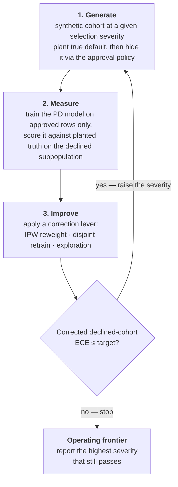

# CLDD — closed-loop default detection

[](https://github.com/hossainpazooki/closed-loop-default-detection/actions/workflows/ci.yml)
[](LICENSE)
[](docs/)
[](pyproject.toml)

**Stress-test a probability-of-default (PD) model under *selective labels* — and get the
severity at which it breaks.** Real lending data only labels the loans a prior underwriter
approved, so you cannot measure calibration on the applicants you *declined* — exactly where a
new model must still be right. CLDD builds synthetic lending worlds with planted ground truth,
hides labels the way real approval policies do, and grades every correction against that truth.

- **Deterministic** — byte-identical per seed, scikit-learn-only, no services or GPUs.
- **Pluggable** — correction levers (IPW, retrain, exploration, reject inference) are classes;
  add yours by subclassing `Corrector`.
- **Honest by construction** — every number below recomputes from committed CSVs; limits are
  reported, not smoothed over.

## The result it produces

The loop escalates selection severity until correction fails and reports the **operating
frontier** — the last severity at which declined-cohort calibration still holds (target
ECE ≤ 0.10). From the committed runs (`artifacts/clue_frontier*.csv`, seed 42):

| Selection severity | 0.0 | 0.2 | 0.4 | 0.6 |
|---|---|---|---|---|
| Naive declined ECE (flat world) | 0.021 | 0.045 | 0.108 | 0.161 |
| **IPW-corrected** (flat world) | 0.020 | 0.038 | **0.086 ✓** | **0.154 ✗** |
| **IPW-corrected** (SCM world) | 0.036 | 0.038 | **0.097 ✓** | **0.244 ✗** |

Both worlds land the frontier at **severity 0.4**, and the counterfactual deliverable breaks at
the same boundary: across 25 seeds, g-computation cuts strong-propagation counterfactual MAE
from 0.099 to 0.086 (−13.5%, positive on 24/25 seeds, Wilcoxon p = 1.5e-7) *inside* the
frontier — and collapses to a negligible +0.0017 at full severity, where **no deployable
advantage is claimed**. One cause explains both: selection through an **unobserved
confounder**, which backdoor adjustment and IPW cannot fix. That single measured limit — not
an unverifiable score — is the deliverable.

Reproduce the headline from committed evidence: `python scripts/paired_significance.py`.
The full independent assessment (methodology, all numbers, what didn't hold) is the
accompanying article, [`FABLE.md`](FABLE.md).

## Install

> **Not on PyPI yet** (planned). Install from source; the import name is **`cldd`**.

```bash
git clone https://github.com/hossainpazooki/closed-loop-default-detection.git
cd closed-loop-default-detection
pip install -e ".[dev]"
```

Python ≥ 3.10; dependencies are ranges (`numpy>=2.0`, `pandas>=2.2`, `scikit-learn>=1.6`,
`scipy>=1.11`, `matplotlib>=3.8`) so `cldd` sits alongside your stack. Exact pins for
float-exact reproduction: [`requirements-dev.txt`](requirements-dev.txt)
([details](docs/validation.md)).

## 60-second tour

```python
from cldd import SelectiveLabelsLoop

result = SelectiveLabelsLoop(improve_mode="both").run()   # "reweight" | "retrain" | "both"
print("Operating frontier:", result.frontier_severity)
for r in result.rounds:
    print(r.selection_severity, r.naive.declined_ece, r.passed)
```



A runnable end-to-end demo (classic + custom-lever paths) is
[`examples/quickstart.py`](examples/quickstart.py). Full mechanics, diagnostics, and the
feedback simulation: [docs/how-it-works.md](docs/how-it-works.md).

> **Scope.** CLDD is a synthetic **validation harness**, not a production pipeline: retraining
> and feedback are seeded simulations inside the harness; it never acts on live data or real
> lending decisions.

## What's in the box

Everything is importable from top-level `cldd` (full reference: the [Sphinx docs](docs/)):

| Import | What it is |
|---|---|
| `SelectiveLabelsLoop` | the closed loop; `.run()` → `LoopResult` (frontier + per-round metrics) |
| `Corrector` + `NaiveCorrector`, `IPWReweightCorrector`, `DisjointRetrainCorrector`, `ExplorationCorrector` | the lever ABC and the four built-ins |
| `ReclassificationCorrector`, `AugmentationCorrector`, `FuzzyAugmentationCorrector`, `ParcellingCorrector` | four classic reject-inference methods, graded against planted truth ([honest results](docs/reject_inference.md)) |
| `SyntheticBorrowerGenerator`, `StructuralBorrowerGenerator` | the flat and fitted-SCM synthetic worlds |
| `run_counterfactual_eval`, `GComputationEstimator` | counterfactual validator (g-computation vs naive conditioning) |
| `FeedbackLoop` | model-in-the-loop selective-labels simulation |
| `positivity_diagnostics` | observable regime/drift alarm — needs **no** declined-row labels |
| `CalibratedPDClassifier` | the calibrated PD detector as a scikit-learn estimator |
| `cldd.fidelity.run_fidelity_gate` | SCM-vs-real **marginal**-fidelity gate (univariate marginals only) |

**Add a lever** by subclassing `Corrector` (`name`, `control_priority`, `apply`) and passing
`correctors=[NaiveCorrector(), MyCorrector()]` — the legacy `improve_mode` API is unchanged
and byte-identical. Contract details: [CONTRIBUTING.md](CONTRIBUTING.md).

**Use the detector from sklearn tooling** — `CalibratedPDClassifier` is a thin, tested wrapper
(binary-only; NaN features OK; the full `check_estimator` battery passes with zero failed
checks on scikit-learn 1.7.2–1.9.0; probabilities byte-identical to the research API):

```python
from sklearn.model_selection import cross_val_score
from cldd import CalibratedPDClassifier

scores = cross_val_score(CalibratedPDClassifier(random_state=42), X, y, scoring="neg_brier_score")
```

## Command-line drivers

Each driver runs without install (adds `src/` to the path) and writes to `artifacts/`:

```bash
python scripts/run_clue.py                    # the closed loop → frontier table + plot (--generator scm for the SCM world)
python scripts/run_seed_sweep.py --quick      # counterfactual certification (drop --quick for all seeds)
python scripts/run_reject_inference.py        # reject-inference levers vs the frontier
python scripts/run_exploration_sweep.py       # frontier vs exploration budget
python scripts/run_feedback.py                # model-in-the-loop feedback simulation
python scripts/paired_significance.py         # recompute the headline stat from committed CSVs
```

## Validation

`pytest` — 123 tests, all synthetic, no real data needed. CI runs a pinned-repro job (exact
pins), a cross-version/OS compat matrix, and a strict docs build. Six float-sensitive tests
reproduce only under the pins in `requirements-dev.txt`; the optional marginal-fidelity gate
compares the SCM against a **private** real dataset via `CLDD_DATA_DIR` and is the only thing
that needs it. Details, reproducibility, and troubleshooting:
[docs/validation.md](docs/validation.md).

## Documentation

| Where | What |
|---|---|
| [docs/quickstart.md](docs/quickstart.md) | run the loop, the counterfactual eval, the fidelity report |
| [docs/how-it-works.md](docs/how-it-works.md) | loop mechanics, diagnostics, feedback simulation, repo map |
| [docs/configuration.md](docs/configuration.md) | every knob (`config.py`) and the one env var |
| [docs/validation.md](docs/validation.md) | tests, gates, reproducibility, troubleshooting |
| [docs/reject_inference.md](docs/reject_inference.md) | the four RI methods and their honest (modest) results |
| [`FABLE.md`](FABLE.md) | **the accompanying article** — independent results & methodology assessment |

Build locally: `pip install -e ".[docs]" && sphinx-build -b html -W docs docs/_build/html`.

## Status

`0.1.0` **alpha**, changelog in [CHANGELOG.md](CHANGELOG.md). Shipped: the loop, both worlds,
all levers, the fidelity gate, the sklearn estimator, CI on three gates. Planned: PyPI
release. CLDD began as a validation harness for the Intuit TechWeek SMB Underwriting
Challenge; it is not a submission and does not alter challenge files.

## Citation

Metadata in [`CITATION.cff`](CITATION.cff) (GitHub's "Cite this repository" reads it):

```bibtex
@software{pazooki_cldd_2026,
  author  = {Pazooki, Hossain},
  title   = {{closed-loop-default-detection}: measuring selective-labels default
             detection and the PD model's operating frontier},
  year    = {2026},
  version = {0.1.0},
  license = {MIT},
  url     = {https://github.com/hossainpazooki/closed-loop-default-detection}
}
```
