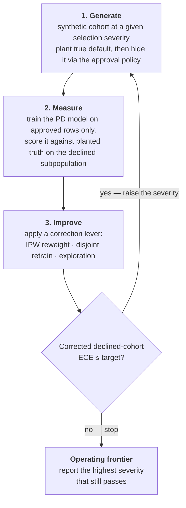

# CLDD — closed-loop default detection

[](https://github.com/hossainpazooki/closed-loop-default-detection/actions/workflows/ci.yml)
[](LICENSE)
[](docs/)
[](pyproject.toml)

**Stress-test a probability-of-default (PD) model under *selective labels* — and get the
severity at which it breaks.** Real lending data only labels the loans a prior underwriter
approved, so you cannot measure calibration on the applicants you *declined* — exactly where a
new model must still be right. CLDD builds synthetic lending worlds with planted ground truth,
hides labels the way real approval policies do, and grades every correction against that truth.

- **Deterministic** — byte-identical per seed, scikit-learn-only, no services or GPUs.
- **Pluggable** — correction levers (IPW, retrain, exploration, reject inference) are classes;
  add yours by subclassing `Corrector`.
- **Honest by construction** — every number below recomputes from committed CSVs; limits are
  reported, not smoothed over.

```bash
pip install closed-loop-default-detection      # the library (PyPI, v0.3.0)
# reproduce the headline statistic from the committed artifact (needs the repo checkout):
python scripts/paired_significance.py
```

> **What this is — and is not.** CLDD is a *validation harness* graded against planted
> synthetic ground truth; it is **not a credit-modeling toolkit**. The correction levers it
> ships (IPW, retrain, exploration, reject inference) exist to be *measured against a known
> answer* — nothing in this repo is validated for making decisions on real borrower data.

## The result it produces

The loop escalates selection severity until correction fails and reports the **operating
frontier** — the last severity at which declined-cohort calibration still holds (target
ECE ≤ 0.10). From the committed runs (`artifacts/loop_frontier*.csv`, seed 42):

| Selection severity | 0.0 | 0.2 | 0.4 | 0.6 |
|---|---|---|---|---|
| Naive declined ECE (flat world) | 0.021 | 0.045 | 0.108 | 0.161 |
| **IPW-corrected** (flat world) | 0.020 | 0.038 | **0.086 ✓** | **0.154 ✗** |
| **IPW-corrected** (SCM world) | 0.036 | 0.038 | **0.097 ✓** | **0.244 ✗** |

On **this seed** both worlds land the frontier at severity 0.4, and the counterfactual
deliverable breaks at the same boundary: across 25 seeds, g-computation cuts
strong-propagation counterfactual MAE from 0.099 to 0.086 (−13.5%, positive on 24/25 seeds,
Wilcoxon p = 1.5e-7; on an independent spaced seed set: 22/25, p = 1.6e-6) *inside* the frontier — and collapses to a negligible +0.0017 at full
severity, where **no deployable advantage is claimed**. One cause explains both: selection
through an **unobserved confounder**, which backdoor adjustment and IPW cannot fix. That
single measured limit — not an unverifiable score — is the deliverable.

### The frontier is a distribution, not a point (v2)

A frontier quoted from one seed is a figure published without an error bar. `v0.2.0` runs the
loop across the full 25-seed set (`artifacts/frontier_sweep.csv`) — and **seed 42 turns out to
sit at the optimistic end**:

| World | min | median | max | seeds at 0.4 | seeds at 0.2 |
|---|---|---|---|---|---|
| flat | 0.2 | **0.4** | 0.4 | 15/25 | 10/25 |
| SCM | 0.2 | **0.2** | 0.4 | 11/25 | 14/25 |

In the SCM world, on this seed set, the *majority of seeds fail one step earlier than the
headline*: the median frontier is **0.2**, and seed 42's 0.4 is a minority outcome (11/25). The honest statement is
that the operating frontier is **0.2–0.4 depending on the draw**, not a clean 0.4 — the
single-seed table above is a valid instance of it, not its center. Nothing about the
mechanism changes (the unobserved confounder still explains the failure); what changes is how
precisely the boundary can be quoted.

*Caveat on the sweep:* loop seed `s` consumes generator seeds `s..s+7`, and the 25-seed set has
gaps smaller than 8, so some runs share feature draws. No two runs duplicate a cohort, but the
25 rows are not fully independent — the set is kept for comparability with the counterfactual
sweep that uses it.

*Caveat, measured (2026-07-29):* both sweeps were re-run on a spaced set — seeds
{1000 + 16i, i = 0..24}, spaced widely enough that no two runs **within the same generator**
(loop sweep) or **at the same severity** (counterfactual sweep) share any consumed seed; the
same seed across severities/generators stays deliberately paired
(`scripts/run_spaced_sweeps.py`; `artifacts/seed_sweep_spaced.csv`,
`artifacts/frontier_sweep_spaced.csv`). Two different verdicts:

- **Counterfactual — independent replication; the effect survives.** +0.0129 ± 0.0102,
  positive on 22/25 seeds, Wilcoxon p = 1.6e-6 (recompute:
  `python scripts/paired_significance.py --sweep-csv artifacts/seed_sweep_spaced.csv`); at
  full severity the spaced gap is +0.0024 ± 0.0030 — same conclusion, significant in sign and
  negligible in magnitude. A source audit during this rerun found a counterfactual run
  consumes only seeds `{s, s+1000}`, so the *original* counterfactual set was already
  cross-run independent within each severity: the seed-overlap caveat above genuinely applies
  to the loop sweep only, and the move from p = 1.5e-7 (24/25) to p = 1.6e-6 (22/25) is
  replicate variability between two valid designs, not a de-biasing.
- **Frontier — the overlap was real here, and removing it moves the center.** On the spaced
  set the distribution shifts toward 0.4: flat median 0.4 (18/25 at 0.4, 7/25 at 0.2), SCM
  median **0.4** (15/25 at 0.4, 10/25 at 0.2). The overlapping set's SCM median of 0.2 does
  **not** replicate on seed-disjoint runs; what survives is the range — 0.2–0.4 depending on
  the draw — with the independent draw putting the SCM center at 0.4.

Reproduce the headline from committed evidence: `python scripts/paired_significance.py`.
The full independent assessment (methodology, all numbers, what didn't hold) is the
accompanying article, [`docs/assessment.md`](docs/assessment.md) — a **dated snapshot**, written
against the single-seed frontier and not retro-fitted with the distribution above.

## Pricing the frontier (v2)

Calibration says *whether* the model is wrong on the declines; it does not say **what being
wrong costs**. v2 adds an expected-maximum-profit (EMP) reporting axis — computed from the
same in-process scores the loop already measures, and **never** a loop-control input (ECE
still decides pass/fail and the frontier). Two variants run side by side:

| Variant | Parameters | What it answers |
|---|---|---|
| `empc` — literature EMPC | Verbraken et al. (2014) prior: `p0=0.55, p1=0.10, ROI=0.2644` | benchmark-comparable: what the standard measure says |
| `emp_h` — harness-derived | this harness's own economics + **planted** default timing | what the loan structure actually pays |

**The two disagree — and the disagreement is the finding.** In the SCM world they move in
opposite directions as selection severity rises (from `artifacts/loop_frontier_scm.csv`,
declined subpopulation, seed 42):

| Selection severity | 0.0 | 0.2 | 0.4 | 0.6 |
|---|---|---|---|---|
| Literature `empc` (naive) | 0.0217 | 0.0331 | 0.0416 | **0.0420 ↑** |
| Harness `emp_h` (naive) | 0.0387 | 0.0297 | 0.0139 | **0.0024 ↓** |

The convenience prior **misprices this loan structure**: it assumes `ROI = 0.2644` where a
60-day daily-ACH loan actually returns `0.0875` (3% origination fee + 5.75% term interest) —
a **3.0× overstatement** — and puts **55% of defaults at full recovery where the harness plants
1.2%** (prior mean λ = 0.275 vs harness 0.419). Priced honestly, the profit on the declined
pool collapses to near-zero at the frontier; priced by the literature prior, it appears to
*grow*. Same model, same scores, opposite conclusion.

**Reading caveats — the boundary of what this measures:**

- **Raw EMP moves with world hardness.** A riskier declined pool changes EMP even for a
  perfect model, so a cross-severity EMP delta is *not* pure model signal. Read the two
  variants against each other at fixed severity, not the trend in isolation.
- **`emp_h` rests on unfitted timing.** `days_to_default` is planted but independent of
  features and risk given default — spec-shaped, never validated against real recovery data.
  So `emp_h` is a **verified experiment, not a verified result**: the arithmetic is exact, the
  timing distribution is an assumption.
- **Post-term defaults are imputed.** ~22.5% of planted defaults land at day 90, past the
  60-day term, and the generator does not model their payment history; they are priced at the
  cohort's mean in-term loss fraction (a stated convention, not measured truth).
- **`emp_h` is SCM-only.** The flat generator plants no timing, so its `emp_h` columns are
  empty by design; only `empc` is reported there.

Exploration now carries a price tag too. From `artifacts/exploration_frontier.csv` (SCM,
seed 42, 10% budget, severity 0.6): the lever buys **157 labels for $439,578** — about
**$2,800 per label**, of which 56 are realized defaults. That is the cost of *identification*,
in dollars a lender can see, on the only lever that buys it rather than reweighting what is
already identified.

## Pricing the feedback loop (v3)

`v0.3.0` prices the **dynamic** regime, where the model's own approvals create its next
training set: three arms (treatment = retrain each generation; **frozen** = generation-0
model deployed forever; **prior** = prior-policy funding), 25 spaced seeds × 3 severities ×
2 exploration rates × 12 generations = **450 runs**
(`artifacts/feedback_profit_sweep.csv`), with three pre-registered hypotheses tested as
within-seed paired contrasts on realized funded-book P&L at severity 0.4, Holm-corrected.
Every number below recomputes via `python scripts/feedback_sweep_stats.py`. All of it
consumes **planted, risk-unlinked default timing** — a verified *experiment*, not a
verified *result*.

| Hypothesis (severity 0.4, gens 1–11) | Median paired deficit | Sign | Verdict |
|---|---|---|---|
| H1 feedback accumulation costs money (treatment − frozen, ε=0) | **−0.0028** | 24/25 | **confirmed** (p_holm 2.3e-06, clears the 0.0018 noise floor) |
| H2 the policy switch costs money (frozen − prior, ε=0) | +0.0119 | 0/25 | **not confirmed — measured opposite in direction** |
| H3 exploration buys profit back (treatment ε=.05 − ε=0) | −0.0024 | 0/25 | **not confirmed** |

The decomposition v3 exists for came back one-for-three: letting the loop close on its own
labels measurably costs the book (H1), but at these severities the *switch* to model-based
funding is profitable relative to the prior policy (H2's predicted sign was wrong — reported
as measured, not softened), and 5% exploration does not pay for itself in-window (H3; the
policy-book-only secondary H3a is negative too). The **H4 integrity control** — frozen-arm
paired difference must equal the explored slice's own P&L *exactly* — holds with max |error|
1.0e-10 across all 900 checked rows, and the answer to the v2-banked question is re-verified at 25 seeds:
the declined-ECE alarm fires at generation 1–2 in every ε=0 run (severity 0.4: 25/25 at
generation 1). Full mechanics in [`docs/how-it-works.md`](docs/how-it-works.md); gates in
[`docs/validation.md`](docs/validation.md).

## Install

```bash
pip install closed-loop-default-detection
```

The import name is **`cldd`**. For development (tests, docs, the committed evidence),
install from source:

```bash
git clone https://github.com/hossainpazooki/closed-loop-default-detection.git
cd closed-loop-default-detection
pip install -e ".[dev]"
```

Python ≥ 3.10; dependencies are ranges (`numpy>=2.0`, `pandas>=2.2`, `scikit-learn>=1.6`,
`scipy>=1.11`, `matplotlib>=3.8`) so `cldd` sits alongside your stack. Exact pins for
float-exact reproduction: [`requirements-dev.txt`](requirements-dev.txt)
([details](docs/validation.md)).

## 60-second tour

```python
from cldd import SelectiveLabelsLoop

result = SelectiveLabelsLoop(improve_mode="both").run()   # "reweight" | "retrain" | "both"
print("Operating frontier:", result.frontier_severity)
for r in result.rounds:
    print(r.selection_severity, r.naive.declined_ece, r.passed)
```



A runnable end-to-end demo (classic + custom-lever paths) is
[`examples/quickstart.py`](examples/quickstart.py). Full mechanics, diagnostics, and the
feedback simulation: [docs/how-it-works.md](docs/how-it-works.md).

> **Scope.** CLDD is a synthetic **validation harness**, not a production pipeline: retraining
> and feedback are seeded simulations inside the harness; it never acts on live data or real
> lending decisions.

## What's in the box

Everything is importable from top-level `cldd` (full reference: the [Sphinx docs](docs/)):

| Import | What it is |
|---|---|
| `SelectiveLabelsLoop` | the closed loop; `.run()` → `LoopResult` (frontier + per-round metrics) |
| `Corrector` + `NaiveCorrector`, `IPWReweightCorrector`, `DisjointRetrainCorrector`, `ExplorationCorrector` | the lever ABC and the four built-ins |
| `ReclassificationCorrector`, `AugmentationCorrector`, `FuzzyAugmentationCorrector`, `ParcellingCorrector` | four classic reject-inference methods, graded against planted truth ([honest results](docs/reject_inference.md)) |
| `SyntheticBorrowerGenerator`, `StructuralBorrowerGenerator` | the flat and fitted-SCM synthetic worlds |
| `run_counterfactual_eval`, `GComputationEstimator` | counterfactual validator (g-computation vs naive conditioning) |
| `FeedbackLoop` | model-in-the-loop selective-labels simulation |
| `empc_literature`, `emp_harness` | the two EMP variants — price the frontier in profit (reporting only, never loop control) |
| `positivity_diagnostics` | observable regime/drift alarm — needs **no** declined-row labels |
| `CalibratedPDClassifier` | the calibrated PD detector as a scikit-learn estimator |
| `cldd.fidelity.run_fidelity_gate` | SCM-vs-real **marginal**-fidelity gate (univariate marginals only) |

**Add a lever** by subclassing `Corrector` (`name`, `control_priority`, `apply`) and passing
`correctors=[NaiveCorrector(), MyCorrector()]` — the legacy `improve_mode` API is unchanged
and byte-identical. Contract details: [CONTRIBUTING.md](CONTRIBUTING.md).

**Use the detector from sklearn tooling** — `CalibratedPDClassifier` is a thin, tested wrapper
(binary-only; NaN features OK; the full `check_estimator` battery passes with zero failed
checks on scikit-learn 1.7.2–1.9.0; probabilities byte-identical to the research API):

```python
from sklearn.model_selection import cross_val_score
from cldd import CalibratedPDClassifier

scores = cross_val_score(CalibratedPDClassifier(random_state=42), X, y, scoring="neg_brier_score")
```

## Command-line drivers

Each driver runs without install (adds `src/` to the path) and writes to `artifacts/`:

```bash
python scripts/run_loop.py                    # the closed loop → frontier table + plot (--generator scm for the SCM world)
python scripts/run_frontier_sweep.py --quick  # frontier distribution across the 25-seed set (drop --quick for all)
python scripts/run_seed_sweep.py --quick      # counterfactual certification (drop --quick for all seeds)
python scripts/run_reject_inference.py        # reject-inference levers vs the frontier
python scripts/run_exploration_sweep.py       # frontier vs exploration budget
python scripts/run_feedback.py                # model-in-the-loop feedback simulation
python scripts/paired_significance.py         # recompute the headline stat from committed CSVs
```

## Validation

`pytest` — 229 tests, all synthetic, no real data needed. CI runs a pinned-repro job (exact
pins), a cross-version/OS compat matrix, and a strict docs build. Six float-sensitive tests
reproduce only under the pins in `requirements-dev.txt`; the optional marginal-fidelity gate
compares the SCM against a **private** real dataset via `CLDD_DATA_DIR` and is the only thing
that needs it. Details, reproducibility, and troubleshooting:
[docs/validation.md](docs/validation.md).

## Documentation

| Where | What |
|---|---|
| [docs/quickstart.md](docs/quickstart.md) | run the loop, the counterfactual eval, the fidelity report |
| [docs/how-it-works.md](docs/how-it-works.md) | loop mechanics, diagnostics, feedback simulation, repo map |
| [docs/configuration.md](docs/configuration.md) | every knob (`config.py`) and the one env var |
| [docs/validation.md](docs/validation.md) | tests, gates, reproducibility, troubleshooting |
| [docs/reject_inference.md](docs/reject_inference.md) | the four RI methods and their honest (modest) results |
| [`docs/assessment.md`](docs/assessment.md) | **the accompanying article** — independent results & methodology assessment (dated snapshot) |

Build locally: `pip install -e ".[docs]" && sphinx-build -b html -W docs docs/_build/html`.

## Status

`0.3.0` **alpha** on [PyPI](https://pypi.org/project/closed-loop-default-detection/),
changelog in [CHANGELOG.md](CHANGELOG.md).

Shipped in 0.1.0: the loop, both synthetic worlds, all correction levers, the fidelity gate,
the sklearn estimator, CI on three gates. Added in 0.2.0: `cldd.emp` (both EMP variants),
priced exploration, the EMP-optimal cutoff, and the 25-seed frontier sweep. Added in 0.3.0:
the three-arm feedback-loop profit decomposition (frozen/prior arms, realized book P&L, the
450-run sweep, hypotheses H1–H4).

CLDD began as a validation harness for the Intuit TechWeek SMB Underwriting Challenge; it is
not a submission and does not alter challenge files.

## Citation

Metadata in [`CITATION.cff`](CITATION.cff) (GitHub's "Cite this repository" reads it):

```bibtex
@software{pazooki_cldd_2026,
  author  = {Pazooki, Hossain},
  title   = {{closed-loop-default-detection}: measuring selective-labels default
             detection and the PD model's operating frontier},
  year    = {2026},
  version = {0.3.0},
  license = {MIT},
  url     = {https://github.com/hossainpazooki/closed-loop-default-detection}
}
```
