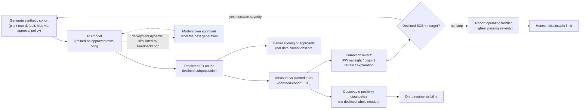

# closed-loop-default-detection

[](https://github.com/hossainpazooki/closed-loop-default-detection/actions/workflows/ci.yml)
[](LICENSE)

A self-contained research harness that stress-tests **probability-of-default (PD)**
modeling under **selective labels** — the central difficulty of the Intuit TechWeek SMB
Underwriting Challenge — and reports the model's honest **operating frontier**.

- **For a stakeholder:** it answers "how far can our PD model be trusted on applicants we
  *declined* and therefore never observed, and where does it stop being trustworthy?"
- **For a developer:** it is a small, deterministic, `sklearn`-only Python package (`cldd`)
  plus a handful of driver scripts that generate synthetic lending cohorts, hide their
  ground truth, and measure correction methods against it.

> **The independent results assessment lives in [`FABLE.md`](FABLE.md).** This README is
> the onboarding and operations guide. Architecture/handoff detail is in
> [`SESSION_HANDOFF.md`](SESSION_HANDOFF.md).

---

## Project overview

Real lending data only records repayment outcomes for loans a prior underwriter
**approved**. The **declined** applicants — the ones a new model must still score — have no
ground truth, so you cannot directly measure calibration on them. This is the *selective
labels* problem.

This harness sidesteps it by working in synthetic worlds where the ground truth is known:

1. **Plant** a true `default_flag` for *every* applicant in a synthetic cohort.
2. **Hide** it through a realistic approval policy (only approved rows get observed labels).
3. **Measure** a PD model trained on approved rows against the planted truth on the
   *declined* subpopulation.
4. **Escalate** the selection severity until correction breaks, and report the **frontier**
   (the highest severity at which calibration still passes).

Because part of the approval policy runs through an **unobserved confounder**, observational
corrections (like inverse-propensity weighting) degrade as severity rises — so the frontier
is a real, defensible limit, not an artifact.

## Closed-loop mechanism



**Why it is useful**

- **Earlier, broader detection.** The loop scores and *calibrates* default risk on the
  **declined** applicants real data never labels — not just the approved book — so blind
  spots surface before they cost anything.
- **Improvement from observed outcomes (within the harness).** Each round applies correction
  levers (IPW reweight, disjoint-cohort retrain, exploration-bought labels) and re-measures;
  `FeedbackLoop` additionally simulates the deployment dynamic where the model's own approvals
  shape the next generation's training labels.
- **Drift and performance visibility.** Observable positivity diagnostics fire *without any
  declined-row label*, and the fidelity gate guards the synthetic world against real-data drift.
- **A clear, checked feedback path.** Every correction is graded against planted ground truth,
  so the loop reports a defensible **operating frontier** instead of an unverifiable score.

> **What this loop is — and isn't.** This is a **synthetic validation harness**, not a live
> production pipeline. The "retrain" lever and the dashed feedback arrow are **deterministic,
> seeded simulations** run inside the harness (the disjoint-cohort retrain lever; the
> `FeedbackLoop` generations) used to characterize the model's limits — **the system does not
> retrain automatically and does not act on live data or real lending decisions.** A deployed
> system's "decision → observed outcome" path is modeled here by the synthetic approval policy
> and, for the model-as-policy dynamic, by `FeedbackLoop`. Wiring any of this into a real
> submission or production system is a separate, manual step (see [Scope-style note in
> Development notes](#development-notes)).

## What "closed-loop default detection" means here

"Closed loop" is the **generate → measure → improve → regenerate** cycle, escalating each
round until the detector fails:

| Stage | Module | What happens |
|---|---|---|
| **Generate** | `cldd/synthetic.py` (or `cldd/scm.py`) | build a cohort at a given `selection_severity ∈ [0,1]` (0 = approval random w.r.t. risk, 1 = approval tracks full latent risk incl. an unobserved confounder) |
| **Measure** | `cldd/eval_default.py` | train PD model on approved rows only; score against planted truth on the **declined** subpopulation (ECE is the headline metric) |
| **Improve** | `cldd/loop.py` | apply correction levers — **IPW reweight**, **retrain** on a disjoint no-leakage cohort, **exploration** (buy labels) |
| **Regenerate / frontier** | `cldd/loop.py` | if the corrected model still clears the target, raise severity; otherwise stop and report the frontier |

"Default detection" is the **measure** stage: detecting and *calibrating* default risk on the
subpopulation that real data structurally cannot score.

## Key capabilities

- **Operating-frontier search** over selection severity with three correction levers
  (IPW reweight / disjoint-cohort retrain / exploration).
- **Two synthetic worlds:** a lightweight flat generator (`synthetic.py`) and a fitted,
  layered **structural causal model** (`scm.py`) whose marginals match the real dataset.
- **Fidelity gate** (`fidelity.py`): verifies the SCM cohort against real-data marginals and
  exits non-zero on drift.
- **Counterfactual validator** (`counterfactual.py`): grades a *deployable* g-computation
  estimator of `do(feature = value)` against naive conditioning, scored on planted truth.
- **Model-in-the-loop feedback simulation** (`feedback.py`): the deployed model's own
  approvals decide the next generation's training labels.
- **Observable positivity diagnostics** (`diagnostics.py`): a regime alarm computable
  *without any declined-row label*.
- **Deterministic and reproducible:** all randomness flows through seeded
  `numpy.random.Generator` streams; dependencies are version-pinned (see below).

## Setup and installation

**Requirements:** Python ≥ 3.10. No system services, no database, no Docker.

```bash
python -m venv .venv
. .venv/Scripts/activate          # Windows; use `. .venv/bin/activate` on macOS/Linux
pip install -e ".[dev]"           # editable install + pytest
```

This installs the library with **dependency ranges** from `pyproject.toml`
(`numpy>=2.0`, `pandas>=2.2`, `scikit-learn>=1.6`, `scipy>=1.11`, `matplotlib>=3.8`,
plus `pytest>=8.0` for `[dev]`), so the package sits alongside your own stack.

> **Ranges for adopters, pins for provenance.** `HistGradientBoosting` float output
> shifts across scikit-learn releases, so the committed numbers and the frozen
> byte-identity test were captured under a **pinned** environment —
> **scikit-learn 1.9.0 / numpy 2.4.6** (Python 3.14.2), recorded in
> `requirements-dev.txt`. To reproduce those exact figures, install from that file
> (`pip install -r requirements-dev.txt && pip install -e . --no-deps`); the CI
> `pinned-repro` job does this and runs the full suite. A handful of float-exact
> tests are marked `pinned` and are reproducible **only** under those pins — the CI
> `compat` matrix (other Python/sklearn versions) deselects them with
> `-m "not pinned"`. See [Troubleshooting](#troubleshooting).

## How to run locally

All scripts are runnable directly (they put `src/` on the path, so no install is strictly
required) and write to `artifacts/`.

```bash
# 1) The closed loop — builds the operating-frontier table + plot, prints a summary
python scripts/run_clue.py                      # flat world (default)
python scripts/run_clue.py --generator scm      # SCM world (writes *_scm artifacts)
python scripts/run_clue.py --exploration-rate 0.10   # add the exploration lever

# 2) Multi-seed counterfactual certification (g-computation vs naive)
python scripts/run_seed_sweep.py                # full sweep
python scripts/run_seed_sweep.py --quick        # seed 42 only (smoke)

# 3) Exploration-budget sweep (frontier vs labels bought)
python scripts/run_exploration_sweep.py [--quick]

# 4) Model-in-the-loop feedback simulation
python scripts/run_feedback.py [--quick]

# 5) Paired significance test on the committed 25-seed sweep
python scripts/paired_significance.py
```

`run_clue.py` prints a Deliverable-D-ready summary (frontier severity + §3/§4/§5 hooks) and
writes `artifacts/clue_frontier.{csv,png}` (or `clue_frontier_scm.*` with `--generator scm`,
so flat artifacts are never overwritten).

## How to run tests and validation

```bash
pytest                          # full suite — expect 66 passed (pinned environment)
pytest -m "not pinned"          # 63 tests — what the CI compat matrix runs off-pins
pytest tests/test_loop.py       # a single module
```

The three `pinned`-marked tests assert exact/tight floating-point output of the
calibrated PD model and pass only under the `requirements-dev.txt` pins; on any
other scikit-learn/numpy the last decimals move. CI runs them in the `pinned-repro`
job and skips them in the cross-version `compat` matrix.

Two project-specific "validation" gates beyond the unit tests:

```bash
# Fidelity gate — SCM cohort vs real-data marginals; exit 0 = pass, 1 = fail/data-missing
python scripts/check_fidelity.py --data-dir /path/to/dataset
python scripts/check_fidelity.py --data-dir /path/to/dataset --n 16000 --seed 42

# Reproduce the headline statistic from committed evidence
python scripts/paired_significance.py   # recomputes from artifacts/seed_sweep_25.csv
```

The fidelity gate needs the real `train.csv` (it is the *only* command that does); all other
scripts and the whole test suite run on synthetic data alone.

## Example usage / workflow

**Typical flow:** install → run the loop → inspect the frontier → (optionally) certify the
counterfactual result → check fidelity.

```bash
pip install -e ".[dev]"
pytest                              # confirm 66/66 in your environment
python scripts/run_clue.py          # operating frontier (flat world)
python scripts/run_seed_sweep.py    # multi-seed counterfactual certification
```

**Using the package directly** (the same call the loop driver makes):

```python
from cldd import SelectiveLabelsLoop

loop = SelectiveLabelsLoop(improve_mode="both")   # "reweight" | "retrain" | "both"
result = loop.run()

print("Operating frontier (highest passing severity):", result.frontier_severity)
for r in result.rounds:
    print(r.selection_severity, r.naive.declined_ece, r.passed)
```

Other public entry points exported from `cldd` include `StructuralBorrowerGenerator`,
`run_counterfactual_eval`, `GComputationEstimator`, `FeedbackLoop`, and
`positivity_diagnostics` (see `src/cldd/__init__.py` for the full list).

## Repository structure

```
.
├── src/cldd/                 # the package (import as `cldd`)
│   ├── config.py             # seeds, loan economics, severity grid, diagnostic thresholds
│   ├── synthetic.py          # SyntheticBorrowerGenerator — flat world (drives the loop)
│   ├── scm.py                # StructuralBorrowerGenerator — fitted SCM world
│   ├── model_pd.py           # calibrated PD model (HistGBT + isotonic) + IPW weights
│   ├── eval_default.py       # measure: train-on-approved / score-on-truth
│   ├── loop.py               # SelectiveLabelsLoop — improve / frontier
│   ├── feedback.py           # FeedbackLoop — model-in-the-loop selective labels
│   ├── diagnostics.py        # observable positivity diagnostics
│   ├── fidelity.py           # VERIFY-FIDELITY gate vs real-data marginals
│   └── counterfactual.py     # Deliverable-C query set + estimator grading
├── scripts/                  # runnable drivers (each adds src/ to sys.path, no install needed)
│   ├── run_clue.py           # the closed loop → clue_frontier{,_scm}.{csv,png}
│   ├── run_seed_sweep.py     # multi-seed counterfactual certification → seed_sweep.csv
│   ├── run_exploration_sweep.py  # frontier vs exploration budget → exploration_frontier.csv
│   ├── run_feedback.py       # feedback generations → feedback_generations.csv
│   ├── paired_significance.py    # paired test on the sweep → paired_significance.csv
│   └── check_fidelity.py     # fidelity gate (exit non-zero on drift)
├── tests/                    # pytest suite (66 tests)
├── artifacts/                # outputs: CSVs (some committed as evidence) + PNGs (gitignored)
├── pyproject.toml            # package metadata + pinned dependencies
├── requirements-dev.txt      # pinned dev environment (mirror of the pins)
├── FABLE.md                  # independent results & methodology assessment
└── SESSION_HANDOFF.md        # architecture / handoff notes
```

## Configuration and environment variables

**There are no environment variables.** Configuration is code-level and explicit:

- **`src/cldd/config.py`** is the single source of truth for the knobs:

  | Constant | Default | Meaning |
  |---|---|---|
  | `RANDOM_SEED` | `42` | base seed for all streams |
  | `TRAIN_SEED_OFFSET` | `1000` | disjoint-cohort offset for the no-leakage retrain lever |
  | `START_SEVERITY` / `SEVERITY_STEP` / `MAX_SEVERITY` | `0.0` / `0.2` / `1.0` | the severity grid the loop sweeps |
  | `MAX_ROUNDS` | `8` | frontier-search round cap |
  | `TARGET_DECLINED_ECE` | `0.10` | a round passes when corrected declined ECE ≤ this |
  | `DEFAULT_N_APPLICANTS` | `4000` | cohort size |
  | `TARGET_BASE_DEFAULT_RATE` / `DEFAULT_APPROVAL_RATE` | `0.17` / `0.60` | planted base rate / prior-policy funding rate |
  | `DIAG_*` | — | positivity-diagnostic thresholds (see the calibration note in `config.py`) |

- **Per-run options** are CLI flags on the driver scripts (see [How to run
  locally](#how-to-run-locally)), not env vars.
- **Real-data location** for the fidelity gate is `cldd.fidelity.DEFAULT_DATA_DIR`. It
  currently points at an absolute local path on the original author's machine
  (`…/intuit-techweek-nyc-hackathon-2026/dataset`). **On any other machine, pass
  `--data-dir /path/to/dataset` explicitly** — the gate is the only thing that touches real
  data, and everything else is synthetic. *(TODO: make this default portable, e.g. an
  env-var or relative-path fallback, instead of a hardcoded absolute path.)*

## Data inputs and outputs

**Inputs**

- **None required** for the loop, counterfactual eval, feedback simulation, or tests — all
  cohorts are generated synthetically from seeds.
- **Real dataset (fidelity gate only):** a directory containing `train.csv` (the Intuit SMB
  dataset, distributed with the sibling hackathon repo), supplied via `--data-dir`.

**Outputs** (written to `artifacts/`)

| File | Produced by | Notes |
|---|---|---|
| `clue_frontier.{csv,png}` / `clue_frontier_scm.{csv,png}` | `run_clue.py` | frontier table + plot |
| `seed_sweep.csv` | `run_seed_sweep.py` | 5-seed counterfactual certification (committed) |
| `seed_sweep_25.csv`, `severity_curve.csv` | committed evidence | 25-seed sweep + collapse curve |
| `exploration_frontier.csv` | `run_exploration_sweep.py` | frontier vs exploration budget |
| `feedback_generations.csv` | `run_feedback.py` | per-generation feedback metrics |
| `paired_significance.csv` | `paired_significance.py` | paired test on the 25-seed gap |

`artifacts/` is gitignored **except** an allowlist of CSVs (and the sweep driver) that are
committed so the figures quoted in `FABLE.md` are recomputable from source. PNGs are not
committed.

## Development notes

- **Determinism is an invariant.** Every run is byte-identical per seed; all randomness goes
  through one seeded `numpy.random.Generator`, and levers use dedicated RNG stream tags
  (`config.EXPLORE_STREAM_*`) so they can't shift a generator's stream.
- **No-leakage discipline.** The retrain lever fits on a disjoint cohort
  (`RANDOM_SEED + TRAIN_SEED_OFFSET + iteration`); the naive PD model is fit on approved rows
  only. Don't collapse these.
- **Two generators, one contract.** `scm.py` returns a *superset* of the loop's cohort dict,
  so `SelectiveLabelsLoop` can run on either world. Keep that contract stable.
- **The fidelity gate is the guard.** Any change to SCM marginals must keep
  `check_fidelity.py` green, or the tolerances must be revisited deliberately.
- **Scope boundary.** This repo is a *validation harness*. It does **not** produce or alter
  the challenge's A/B/C submission files; wiring its conclusions into a real submission is a
  separate step (see `SESSION_HANDOFF.md`).
- **`src/` layout.** Scripts inject `src/` onto `sys.path`, so they run without installing,
  but `pip install -e .` is recommended for tests and imports.

## Troubleshooting

- **`pytest` shows a few failures with float mismatches (e.g. the byte-identity baseline,
  the seed-robustness or exploration-bias thresholds).** You are almost certainly on a
  different scikit-learn/numpy than the pins. `HistGradientBoosting` output shifts across
  releases; install the pinned versions (`pip install -e ".[dev]"` or
  `pip install -r requirements-dev.txt`). With **scikit-learn 1.9.0 / numpy 2.4.6** the suite
  is 66/66. See `FABLE.md` §8 and `pyproject.toml`.
- **`ModuleNotFoundError: No module named 'cldd'` when running `pytest`.** Install the package
  (`pip install -e ".[dev]"`); the scripts add `src/` to the path themselves, but the tests
  import `cldd` as an installed package.
- **`check_fidelity.py` prints `ERROR: …` / exits 1 with "data not found".** The default
  `DEFAULT_DATA_DIR` is a machine-specific absolute path. Pass `--data-dir /path/to/dataset`
  pointing at a directory that contains `train.csv`.
- **`run_seed_sweep.py` is slow / memory-heavy.** By design it launches **one subprocess per
  (seed, severity) eval** — two evals in a single process have exhausted memory. Use
  `--quick` for a seed-42 smoke run.
- **No plot window appears.** Scripts use the headless `Agg` matplotlib backend and write PNGs
  to `artifacts/`; there is nothing to display interactively.

## Citation

If you use this harness, please cite it. Metadata lives in
[`CITATION.cff`](CITATION.cff) (GitHub's "Cite this repository" reads it); the
equivalent BibTeX is:

```bibtex
@software{pazooki_cldd_2026,
  author  = {Pazooki, Hossain},
  title   = {{closed-loop-default-detection}: measuring selective-labels default
             detection and the PD model's operating frontier},
  year    = {2026},
  version = {0.1.0},
  license = {MIT},
  url     = {https://github.com/hossainpazooki/closed-loop-default-detection}
}
```

---

### Related documents

- **[`FABLE.md`](FABLE.md)** — independent assessment of the results (the numbers, the limits,
  what to claim and what not to).
- **[`SESSION_HANDOFF.md`](SESSION_HANDOFF.md)** — deeper architecture, the SCM design, and the
  public API surface.
