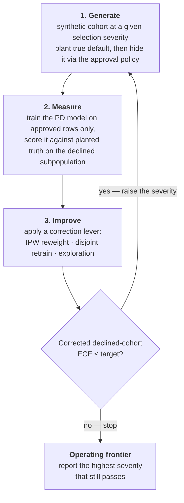
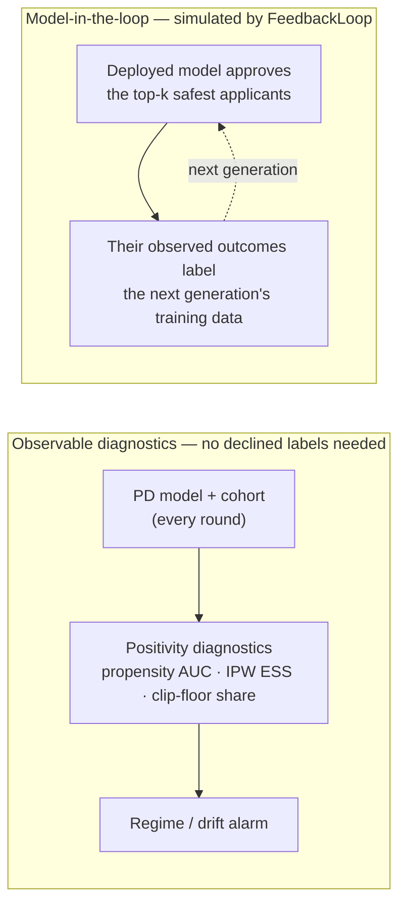

# CLDD — closed-loop default detection

[](https://github.com/hossainpazooki/closed-loop-default-detection/actions/workflows/ci.yml)
[](LICENSE)
[](docs/)

**CLDD (`cldd`) is a deterministic, scikit-learn-only Python library for stress-testing
credit-risk / probability-of-default (PD) models under *selective labels*.** It builds
synthetic lending worlds with known ground truth, hides labels the way real approval
policies do, and measures where a PD model stays trustworthy on the applicants it
*declined* — and the selection severity at which it breaks down (the model's **operating
frontier**).

The correction levers are **pluggable** (add one by subclassing `Corrector`), the whole
harness is **byte-deterministic** per seed, and every result is graded against planted
ground truth rather than an unverifiable score.

## Why it exists

Real lending data only records repayment for loans a prior underwriter **approved**. The
**declined** applicants — the ones a new model must still score — have no observed outcome,
so you cannot directly measure calibration on them. This is the *selective labels* problem,
and it is why an offline PD model can look well-calibrated and still be wrong exactly where
it matters.

CLDD sidesteps it by working where the ground truth is known:

1. **Plant** a true `default_flag` for *every* applicant in a synthetic cohort.
2. **Hide** it through a realistic approval policy (only approved rows get observed labels).
3. **Measure** a PD model trained on approved rows against the planted truth on the
   *declined* subpopulation.
4. **Escalate** the selection severity until correction breaks, and report the **frontier**.

Because part of the approval policy runs through an **unobserved confounder**, observational
corrections (like inverse-propensity weighting) degrade as severity rises — so the frontier
is a real, defensible limit, not an artifact.

## Install

> **Not on PyPI yet.** Install from source. The distribution name is
> `closed-loop-default-detection`; the **import name is `cldd`**.

```bash
git clone https://github.com/hossainpazooki/closed-loop-default-detection.git
cd closed-loop-default-detection
python -m venv .venv
. .venv/Scripts/activate          # Windows; use `. .venv/bin/activate` on macOS/Linux
pip install -e ".[dev]"           # editable install + pytest
```

**Requirements:** Python ≥ 3.10. No system services, no database, no Docker. Dependencies are
declared as **ranges** (`numpy>=2.0`, `pandas>=2.2`, `scikit-learn>=1.6`, `scipy>=1.11`,
`matplotlib>=3.8`) so `cldd` sits alongside your own stack. Optional extras: `[dev]` (pytest),
`[docs]` (Sphinx). The exact pins under which the committed numbers reproduce live in
`requirements-dev.txt` — see [Reproducibility](#reproducibility-and-the-pinned-tests).

## Quickstart

```python
from cldd import SelectiveLabelsLoop

loop = SelectiveLabelsLoop(improve_mode="both")   # "reweight" | "retrain" | "both"
result = loop.run()

print("Operating frontier (highest passing severity):", result.frontier_severity)
for r in result.rounds:
    print(r.selection_severity, r.naive.declined_ece, r.passed)
```

`result` is a `LoopResult`; each `result.rounds[i]` is a `RoundResult` carrying the per-lever
`LeverMetrics` and the `control_metric` that drives the frontier search. A runnable end-to-end
demo (classic + custom-lever paths) is in [`examples/quickstart.py`](examples/quickstart.py).

## Public API

Everything below is importable from the top-level `cldd` package (except the fidelity report,
which lives in `cldd.fidelity`). Full reference: the Sphinx docs under [`docs/`](docs/).

| Import | What it is |
|---|---|
| `SelectiveLabelsLoop` | the closed loop; `.run()` → `LoopResult` |
| `LoopResult`, `RoundResult`, `LeverMetrics` | result objects: frontier, per-round record, per-lever metrics |
| `Corrector`, `CorrectorContext`, `CorrectionOutcome` | the lever ABC to subclass + what `apply` receives / returns |
| `NaiveCorrector`, `IPWReweightCorrector`, `DisjointRetrainCorrector`, `ExplorationCorrector` | the four built-in correction levers |
| `SyntheticBorrowerGenerator`, `StructuralBorrowerGenerator` | the flat and fitted-SCM synthetic worlds |
| `run_counterfactual_eval`, `GComputationEstimator` | counterfactual validator (deployable g-computation vs naive conditioning) |
| `FeedbackLoop`, `FeedbackResult`, `GenerationResult` | model-in-the-loop selective-labels simulation |
| `positivity_diagnostics`, `PositivityDiagnostics` | observable regime / drift alarm (needs **no** declined-row labels) |
| `fit_observed_model`, `score_pd_detection` | the measure-stage building blocks (train-on-approved / score-on-truth) |
| `from cldd.fidelity import run_fidelity_gate, FidelityReport` | SCM-vs-real fidelity report with `.get_score()` (0–1) and `.get_details()` (DataFrame) |

### Extending: add a correction lever

The correction levers are pluggable — pass `correctors=[...]` instead of `improve_mode`. A
lever is a `Corrector` subclass (`name`, `control_priority`, `apply`); the present lever with
the highest `control_priority` drives loop control, and `RoundResult.corrections` exposes the
general name→metrics map.

```python
from cldd import SelectiveLabelsLoop, Corrector, NaiveCorrector, CorrectionOutcome

class MyCorrector(Corrector):
    name = "my_lever"
    control_priority = 5          # built-ins: naive=0, retrain=1, reweight=2, explore=3
    def apply(self, cohort, ctx) -> CorrectionOutcome:
        ...                       # return CorrectionOutcome(metrics=..., info={})

result = SelectiveLabelsLoop(correctors=[NaiveCorrector(), MyCorrector()]).run()
```

The list **must include a `NaiveCorrector`** (the loop projects it as `RoundResult.naive`);
omitting it raises a `ValueError` at construction. When `correctors` is omitted, the loop
builds the default list from `improve_mode` / `exploration_rate` exactly as before, so the
legacy API is unchanged (and byte-identical). See [`CONTRIBUTING.md`](CONTRIBUTING.md) →
"Adding a correction lever" for the full contract.

## How the closed loop works

"Closed loop" is the **generate → measure → improve → regenerate** cycle, escalating each
round until the detector fails.



| Stage | Module | What happens |
|---|---|---|
| **Generate** | `cldd/synthetic.py` (or `cldd/scm.py`) | build a cohort at `selection_severity ∈ [0,1]` (0 = approval random w.r.t. risk, 1 = approval tracks full latent risk incl. an unobserved confounder) |
| **Measure** | `cldd/eval_default.py` | train PD model on approved rows only; score against planted truth on the **declined** subpopulation (ECE is the headline metric) |
| **Improve** | `cldd/loop.py` + `cldd/correctors.py` | apply the pluggable correction levers — **IPW reweight**, **retrain** on a disjoint no-leakage cohort, **exploration** (buy labels) |
| **Regenerate / frontier** | `cldd/loop.py` | if the corrected model still clears the target, raise severity; otherwise stop and report the frontier |

**Two mechanisms hang off that loop** — one observable without any declined-row label, one
that simulates the deployment feedback dynamic:



**Why it is useful**

- **Earlier, broader detection.** The loop scores and *calibrates* default risk on the
  **declined** applicants real data never labels — not just the approved book — so blind
  spots surface before they cost anything.
- **Improvement from observed outcomes (within the harness).** Each round applies the
  correction levers and re-measures; `FeedbackLoop` additionally simulates the deployment
  dynamic where the model's own approvals shape the next generation's training labels.
- **Drift and performance visibility.** Observable positivity diagnostics fire *without any
  declined-row label*, and the fidelity gate guards the synthetic world against real-data drift.
- **A clear, checked feedback path.** Every correction is graded against planted ground truth,
  so the loop reports a defensible **operating frontier** instead of an unverifiable score.

> **What this loop is — and isn't.** This is a **synthetic validation harness**, not a live
> production pipeline. The "retrain" lever and the dashed feedback arrow are **deterministic,
> seeded simulations** run inside the harness — **the system does not retrain automatically and
> does not act on live data or real lending decisions.** A deployed system's "decision →
> observed outcome" path is modeled here by the synthetic approval policy and, for the
> model-as-policy dynamic, by `FeedbackLoop`. Wiring any of this into a production system is a
> separate, manual step.

## Command-line drivers

The package ships runnable drivers (each adds `src/` to the path, so no install is strictly
required) that write to `artifacts/`:

```bash
# 1) The closed loop — operating-frontier table + plot + a printed summary
python scripts/run_clue.py                      # flat world (default)
python scripts/run_clue.py --generator scm      # SCM world (writes *_scm artifacts)
python scripts/run_clue.py --exploration-rate 0.10   # add the exploration lever

# 2) Multi-seed counterfactual certification (g-computation vs naive)
python scripts/run_seed_sweep.py [--quick]      # --quick = seed 42 only (smoke)

# 3) Exploration-budget sweep (frontier vs labels bought)
python scripts/run_exploration_sweep.py [--quick]

# 4) Model-in-the-loop feedback simulation
python scripts/run_feedback.py [--quick]

# 5) Paired significance test on the committed 25-seed sweep
python scripts/paired_significance.py
```

## Tests, validation, and docs

```bash
pytest                          # full suite — expect 90 passed (pinned environment)
pytest -m "not pinned"          # 85 tests — what the CI compat matrix runs off-pins
```

Two project-specific validation gates beyond the unit tests:

```bash
# Fidelity gate — SCM cohort vs real-data marginals; exit 0 = pass, 1 = fail/data-missing
python scripts/check_fidelity.py --data-dir /path/to/dataset

# Reproduce the headline statistic from committed evidence
python scripts/paired_significance.py   # recomputes from artifacts/seed_sweep_25.csv
```

The fidelity gate is the **only** command that needs the real `train.csv`; everything else,
including the whole test suite, runs on synthetic data alone.

**Build the docs** (the Sphinx API reference; same strict mode Read the Docs uses):

```bash
pip install -e ".[docs]"
sphinx-build -b html -W docs docs/_build/html   # -W: warnings are errors
```

CI runs three gates: a `pinned-repro` job (full suite under the exact pins), a cross-version /
cross-OS `compat` matrix (`-m "not pinned"`), and a `docs` job (`sphinx-build -W`).

### Reproducibility and the pinned tests

`HistGradientBoosting` float output shifts across scikit-learn releases, so the committed
numbers and the frozen byte-identity baseline were captured under a **pinned** environment —
**scikit-learn 1.9.0 / numpy 2.4.6** (Python 3.14.2), recorded in `requirements-dev.txt`. To
reproduce those exact figures:

```bash
pip install -r requirements-dev.txt && pip install -e . --no-deps
```

The **five** float-exact tests are marked `pinned` and reproduce **only** under those pins; the
CI `compat` matrix deselects them with `-m "not pinned"`. The library deps stay as ranges so a
plain `pip install` works alongside your own sklearn.

## Configuration

**There are no environment variables.** Configuration is code-level and explicit; per-run
options are CLI flags on the drivers. `src/cldd/config.py` is the single source of truth:

| Constant | Default | Meaning |
|---|---|---|
| `RANDOM_SEED` | `42` | base seed for all streams |
| `TRAIN_SEED_OFFSET` | `1000` | disjoint-cohort offset for the no-leakage retrain lever |
| `START_SEVERITY` / `SEVERITY_STEP` / `MAX_SEVERITY` | `0.0` / `0.2` / `1.0` | the severity grid the loop sweeps |
| `MAX_ROUNDS` | `8` | frontier-search round cap |
| `TARGET_DECLINED_ECE` | `0.10` | a round passes when corrected declined ECE ≤ this |
| `DEFAULT_N_APPLICANTS` | `4000` | cohort size |
| `TARGET_BASE_DEFAULT_RATE` / `DEFAULT_APPROVAL_RATE` | `0.17` / `0.60` | planted base rate / prior-policy funding rate |
| `DIAG_*` | — | positivity-diagnostic thresholds (see the calibration note in `config.py`) |

The fidelity gate's real-data location is `cldd.fidelity.DEFAULT_DATA_DIR`, which currently
points at a machine-specific absolute path. **On any other machine pass `--data-dir
/path/to/dataset`** (a directory containing `train.csv`). *(TODO: make this default portable.)*

## Outputs

All drivers write to `artifacts/`:

| File | Produced by | Notes |
|---|---|---|
| `clue_frontier.{csv,png}` / `clue_frontier_scm.{csv,png}` | `run_clue.py` | frontier table + plot |
| `seed_sweep.csv` | `run_seed_sweep.py` | 5-seed counterfactual certification (committed) |
| `seed_sweep_25.csv`, `severity_curve.csv` | committed evidence | 25-seed sweep + collapse curve |
| `exploration_frontier.csv` | `run_exploration_sweep.py` | frontier vs exploration budget |
| `feedback_generations.csv` | `run_feedback.py` | per-generation feedback metrics |
| `paired_significance.csv` | `paired_significance.py` | paired test on the 25-seed gap |

`artifacts/` is gitignored **except** an allowlist of CSVs (and the sweep driver) committed so
the figures quoted in `FABLE.md` are recomputable from source. PNGs are not committed.

## Repository structure

```
.
├── src/cldd/                 # the package (import as `cldd`)
│   ├── config.py             # seeds, loan economics, severity grid, diagnostic thresholds
│   ├── synthetic.py          # SyntheticBorrowerGenerator — flat world (drives the loop)
│   ├── scm.py                # StructuralBorrowerGenerator — fitted SCM world
│   ├── model_pd.py           # calibrated PD model (HistGBT + isotonic) + IPW weights
│   ├── eval_default.py       # measure: train-on-approved / score-on-truth
│   ├── loop.py               # SelectiveLabelsLoop — improve / frontier
│   ├── correctors.py         # Corrector ABC + 4 pluggable levers (naive/reweight/retrain/explore)
│   ├── feedback.py           # FeedbackLoop — model-in-the-loop selective labels
│   ├── diagnostics.py        # observable positivity diagnostics
│   ├── fidelity.py           # fidelity gate + FidelityReport (.get_score / .get_details)
│   └── counterfactual.py     # counterfactual query set + estimator grading
├── scripts/                  # runnable drivers (each adds src/ to sys.path, no install needed)
├── tests/                    # pytest suite (90 tests; 5 marked `pinned`)
├── docs/                     # Sphinx API reference (builds with sphinx-build -W; RTD-ready)
├── examples/                 # runnable quickstart (synthetic-only) + its README
├── CONTRIBUTING.md           # dev setup + how to add a correction lever
├── pyproject.toml            # package metadata + dependency ranges (provenance pins in requirements-dev.txt)
├── requirements-dev.txt      # pinned dev environment (the provenance pins)
├── FABLE.md                  # independent results & methodology assessment
└── SESSION_HANDOFF.md        # architecture / handoff notes
```

## Roadmap

CLDD is being developed from a single-author research harness toward a library other
practitioners can adopt and contribute to. Status is explicit: **Shipped** is in the tree and
tested; **Planned** is proposed, not yet built.

- **[Shipped] Adoption baseline.** MIT `LICENSE`, CI (`pinned-repro` + cross-version/OS
  `compat` + `docs` jobs), `CITATION.cff` + BibTeX, range dependencies with reproducibility
  pins preserved in `requirements-dev.txt`.
- **[Shipped] A pluggable correction interface.** The `improve_mode` string is backed by a
  `Corrector` ABC (`cldd.correctors`): *adding a lever is adding a class*
  (`SelectiveLabelsLoop(correctors=[...])`), the way off-policy-evaluation libraries register
  interchangeable estimators. The legacy `improve_mode` / `exploration_rate` API is byte-
  identical, and `RoundResult.corrections` exposes the general name→metrics map.
- **[Shipped] A first-class fidelity report.** `cldd.fidelity.FidelityReport` gained
  SDMetrics-style `.get_score()` (0–1) and `.get_details()` (per-check DataFrame) accessors, so
  SCM-vs-real drift is drill-downable, not just a pass/fail bit.
- **[Shipped] Docs and a runnable quickstart.** [`examples/quickstart.py`](examples/quickstart.py)
  runs generate → measure → correct → frontier end-to-end and demos a custom lever; the Sphinx
  API reference under `docs/` builds clean under `sphinx-build -W` (RTD config in
  `.readthedocs.yaml`, enforced by the CI `docs` job) and is ready to host.
- **[Planned] PyPI release.** Publish `closed-loop-default-detection` so `pip install` works
  without a clone.
- **[Shipped] A reject-inference module.** Four classic methods (reclassification,
  score-band augmentation, fuzzy augmentation, parcelling) in `cldd.reject_inference`, as
  `Corrector`s **graded against planted truth on a held-out declined fold** — not a
  run-on-your-data API (that would remove the oracle). `scripts/run_reject_inference.py`
  writes `artifacts/reject_inference_frontier.csv`. The honest result: RI lift over the naive
  detector is modest at best and can be negative, and as severity rises the unobserved
  confounder defeats every observational method — matching Kozodoi et al. (2025), who find
  correcting the *evaluation* bias matters more than the imputation. See
  [`docs/reject_inference.md`](docs/reject_inference.md).

## Development notes

- **Determinism is an invariant.** Every run is byte-identical per seed; all randomness goes
  through seeded `numpy.random.Generator` streams, and levers use dedicated RNG stream tags
  (`config.EXPLORE_STREAM_*`) so they can't shift a generator's stream. (A custom `Corrector`
  must likewise seed from `ctx`, not a global RNG.)
- **No-leakage discipline.** The retrain lever fits on a disjoint cohort
  (`RANDOM_SEED + TRAIN_SEED_OFFSET + iteration`); the naive PD model is fit on approved rows
  only. Don't collapse these.
- **Two generators, one contract.** `scm.py` returns a *superset* of the loop's cohort dict, so
  `SelectiveLabelsLoop` runs on either world. Keep that contract stable.
- **The fidelity gate is the guard.** Any change to SCM marginals must keep `check_fidelity.py`
  green, or the tolerances must be revisited deliberately.
- **`src/` layout.** Scripts inject `src/` onto `sys.path`, so they run without installing, but
  `pip install -e .` is recommended for tests and imports.

## Troubleshooting

- **`pytest` shows a few float-mismatch failures (byte-identity baseline, seed-robustness, or
  exploration thresholds).** You are on a different scikit-learn/numpy than the pins. Install
  the pinned versions (`pip install -r requirements-dev.txt`); under **scikit-learn 1.9.0 /
  numpy 2.4.6** the suite is 90/90. See `FABLE.md` §8.
- **`ModuleNotFoundError: No module named 'cldd'` under `pytest`.** Install the package
  (`pip install -e ".[dev]"`); tests import `cldd` as an installed package.
- **`check_fidelity.py` exits 1 with "data not found".** The default `DEFAULT_DATA_DIR` is a
  machine-specific absolute path — pass `--data-dir /path/to/dataset` (with `train.csv`).
- **`run_seed_sweep.py` is slow / memory-heavy.** By design it launches one subprocess per
  (seed, severity) eval; use `--quick` for a seed-42 smoke run.
- **No plot window appears.** Scripts use the headless `Agg` backend and write PNGs to
  `artifacts/`; there is nothing to display interactively.

## Project background

CLDD began as a validation harness for the **Intuit TechWeek SMB Underwriting Challenge**,
where selective labels are the central difficulty. It is a *validation harness*, not a
submission: it does not produce or alter the challenge's submission files, and wiring its
conclusions into a real submission or production system is a separate step. The independent
results-and-methodology assessment lives in [`FABLE.md`](FABLE.md); deeper architecture and the
SCM design are in [`SESSION_HANDOFF.md`](SESSION_HANDOFF.md).

## Citation

If you use CLDD, please cite it. Metadata lives in [`CITATION.cff`](CITATION.cff) (GitHub's
"Cite this repository" reads it); the equivalent BibTeX:

```bibtex
@software{pazooki_cldd_2026,
  author  = {Pazooki, Hossain},
  title   = {{closed-loop-default-detection}: measuring selective-labels default
             detection and the PD model's operating frontier},
  year    = {2026},
  version = {0.1.0},
  license = {MIT},
  url     = {https://github.com/hossainpazooki/closed-loop-default-detection}
}
```
